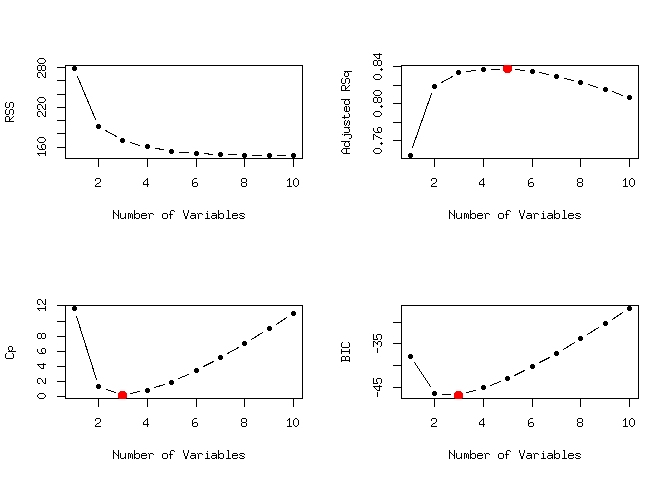
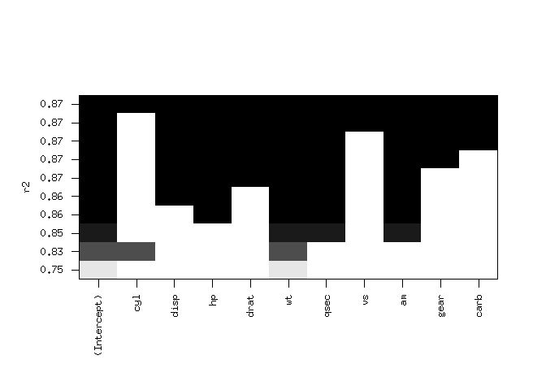
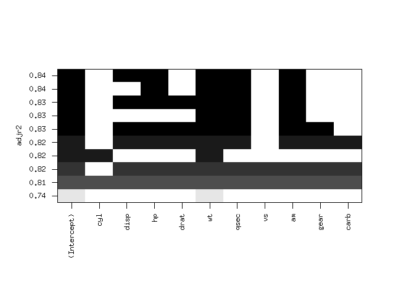
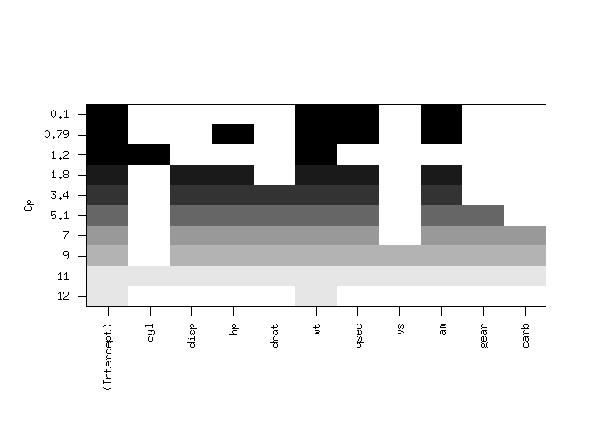
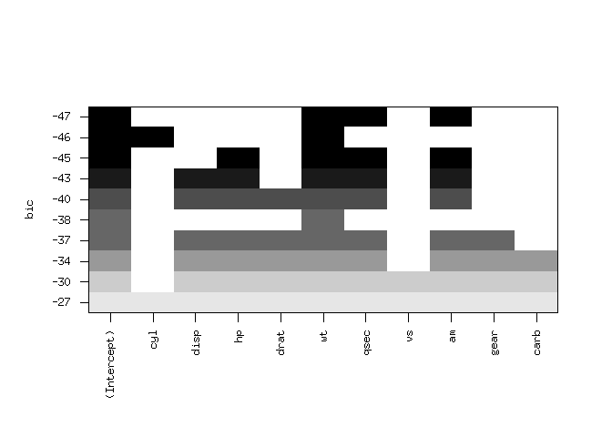
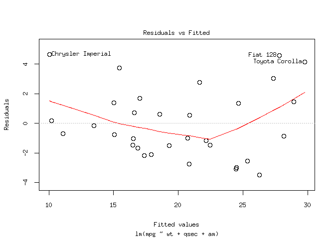
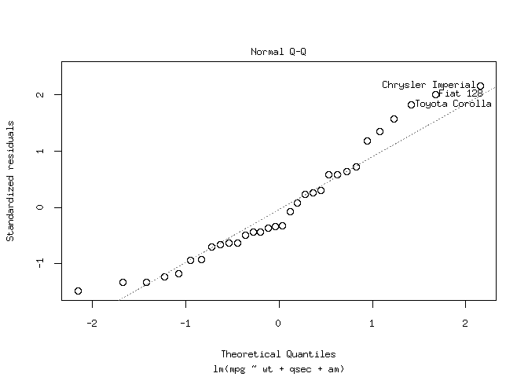
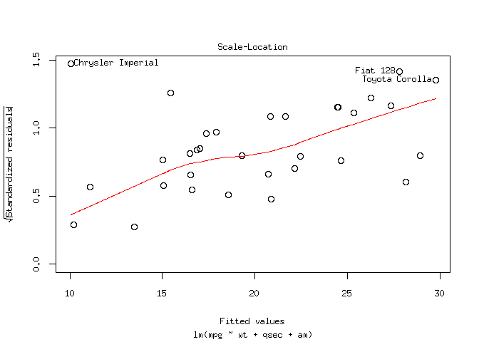
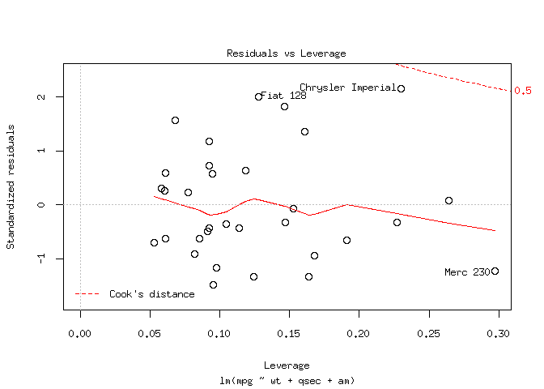
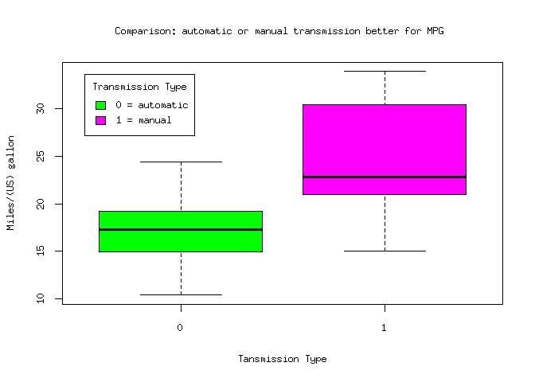

# Regression Model: Peer Assessment 1
Nishant Kumar  
February 12, 2017  

# **Is an automatic or manual transmission better for MPG (Miles/(US) gallon) : MOTOR TREND**

## Instructions

Looking at a data set of a collection of cars, we are interested in exploring the relationship between a set of variables and miles per gallon (MPG) (outcome).

First look at **mtcars** data :


```r
library(datasets)
data(mtcars)
head(mtcars)
```

```
##                    mpg cyl disp  hp drat    wt  qsec vs am gear carb
## Mazda RX4         21.0   6  160 110 3.90 2.620 16.46  0  1    4    4
## Mazda RX4 Wag     21.0   6  160 110 3.90 2.875 17.02  0  1    4    4
## Datsun 710        22.8   4  108  93 3.85 2.320 18.61  1  1    4    1
## Hornet 4 Drive    21.4   6  258 110 3.08 3.215 19.44  1  0    3    1
## Hornet Sportabout 18.7   8  360 175 3.15 3.440 17.02  0  0    3    2
## Valiant           18.1   6  225 105 2.76 3.460 20.22  1  0    3    1
```

```r
summary(mtcars)
```

```
##       mpg             cyl             disp             hp       
##  Min.   :10.40   Min.   :4.000   Min.   : 71.1   Min.   : 52.0  
##  1st Qu.:15.43   1st Qu.:4.000   1st Qu.:120.8   1st Qu.: 96.5  
##  Median :19.20   Median :6.000   Median :196.3   Median :123.0  
##  Mean   :20.09   Mean   :6.188   Mean   :230.7   Mean   :146.7  
##  3rd Qu.:22.80   3rd Qu.:8.000   3rd Qu.:326.0   3rd Qu.:180.0  
##  Max.   :33.90   Max.   :8.000   Max.   :472.0   Max.   :335.0  
##       drat             wt             qsec             vs        
##  Min.   :2.760   Min.   :1.513   Min.   :14.50   Min.   :0.0000  
##  1st Qu.:3.080   1st Qu.:2.581   1st Qu.:16.89   1st Qu.:0.0000  
##  Median :3.695   Median :3.325   Median :17.71   Median :0.0000  
##  Mean   :3.597   Mean   :3.217   Mean   :17.85   Mean   :0.4375  
##  3rd Qu.:3.920   3rd Qu.:3.610   3rd Qu.:18.90   3rd Qu.:1.0000  
##  Max.   :4.930   Max.   :5.424   Max.   :22.90   Max.   :1.0000  
##        am              gear            carb      
##  Min.   :0.0000   Min.   :3.000   Min.   :1.000  
##  1st Qu.:0.0000   1st Qu.:3.000   1st Qu.:2.000  
##  Median :0.0000   Median :4.000   Median :2.000  
##  Mean   :0.4062   Mean   :3.688   Mean   :2.812  
##  3rd Qu.:1.0000   3rd Qu.:4.000   3rd Qu.:4.000  
##  Max.   :1.0000   Max.   :5.000   Max.   :8.000
```


```r
?mtcars
```


## Analysis


Here we apply **Best Subset Selection** approach on **mtcars** data as total no. of variables is 11 which is less than 40. We want to find relationship between set of variables (predictors) on which mpg (outcome) depends the most.
We will use `regsubsets()` function which performs best selection by identifying the best model that contains a given no. of predictors, where *best* is quantified using RSS.


```r
library(leaps)
reg.best<- regsubsets(mpg~.,mtcars,nvmax=10)
summary(reg.best)
```

```
## Subset selection object
## Call: regsubsets.formula(mpg ~ ., mtcars, nvmax = 10)
## 10 Variables  (and intercept)
##      Forced in Forced out
## cyl      FALSE      FALSE
## disp     FALSE      FALSE
## hp       FALSE      FALSE
## drat     FALSE      FALSE
## wt       FALSE      FALSE
## qsec     FALSE      FALSE
## vs       FALSE      FALSE
## am       FALSE      FALSE
## gear     FALSE      FALSE
## carb     FALSE      FALSE
## 1 subsets of each size up to 10
## Selection Algorithm: exhaustive
##           cyl disp hp  drat wt  qsec vs  am  gear carb
## 1  ( 1 )  " " " "  " " " "  "*" " "  " " " " " "  " " 
## 2  ( 1 )  "*" " "  " " " "  "*" " "  " " " " " "  " " 
## 3  ( 1 )  " " " "  " " " "  "*" "*"  " " "*" " "  " " 
## 4  ( 1 )  " " " "  "*" " "  "*" "*"  " " "*" " "  " " 
## 5  ( 1 )  " " "*"  "*" " "  "*" "*"  " " "*" " "  " " 
## 6  ( 1 )  " " "*"  "*" "*"  "*" "*"  " " "*" " "  " " 
## 7  ( 1 )  " " "*"  "*" "*"  "*" "*"  " " "*" "*"  " " 
## 8  ( 1 )  " " "*"  "*" "*"  "*" "*"  " " "*" "*"  "*" 
## 9  ( 1 )  " " "*"  "*" "*"  "*" "*"  "*" "*" "*"  "*" 
## 10  ( 1 ) "*" "*"  "*" "*"  "*" "*"  "*" "*" "*"  "*"
```


An asterisk indicates that a given variable is included in the corresponding model. 


```r
reg.summary<- summary(reg.best)
names(reg.summary)
```

```
## [1] "which"  "rsq"    "rss"    "adjr2"  "cp"     "bic"    "outmat" "obj"
```


The `summary()` function returns *R<sup>2</sup>*, *RSS*, *adjusted R<sup>2</sup>*, *C<sub>p</sub>* and *BIC*.


```r
reg.summary$rsq
```

```
##  [1] 0.7528328 0.8302274 0.8496636 0.8578510 0.8637377 0.8667078 0.8680976
##  [8] 0.8687064 0.8689448 0.8690158
```


For instance, we see that the *R<sup>2</sup>* statistic increases from 75% when only one variable is included in the model, to almost 87% when all variables are included. As expected, the *R<sup>2</sup>* statistic increasees monotonically as more variables are included.


Plotting *RSS*, *C<sub>p</sub>*, *adjusted R<sup>2</sup>* and *BIC* for all models at  once will help us to decide which model to select. We use `which.max()` function to identify the no. variables for which the given statistic i.e. *adjusted R<sup>2</sup>* is max at, here at 5. Similarly we use `which.min()` function to indicate the models with smallest statistics for *C<sub>p</sub>* and *BIC*, which is here 3 and 3 respectively.


```r
par(mfrow=c(2,2))
plot(reg.summary$rss, xlab="Number of Variables ", ylab="RSS", type='b', pch=20)
plot(reg.summary$adjr2, xlab="Number of Variables ", ylab="Adjusted RSq", type='b', pch=20)
points(which.max(reg.summary$adjr2), reg.summary$adjr2[which.max(reg.summary$adjr2)], col="red", cex=2, pch =20)
plot(reg.summary$cp, xlab="Number of Variables ",ylab="Cp",type='b',pch=20)
points (which.min(reg.summary$cp), reg.summary$cp[which.min(reg.summary$cp)], col ="red", cex=2, pch =20)
plot(reg.summary$bic, xlab="Number of Variables ",ylab="BIC", type='b', pch=20)
points(which.min(reg.summary$bic), reg.summary$bic[which.min(reg.summary$bic)], col="red", cex=2, pch =20)
```

<!-- -->


Now we display the selected variables for the best model with given no. of predictors, ranked according to the *BIC*, *C<sub>p</sub>*, *adjusted R<sup>2</sup>*, or *AIC*. The top row of each plot contains a black sqaure for each variable selected according to the optimal model associated with that statistics. For instance, we see that the model with lowest *BIC* is the three-varible model that contains only `wt`, `qsec` and `am` predictors.


```r
plot(reg.best ,scale="r2")
```

<!-- -->

```r
plot(reg.best ,scale="adjr2")
```

<!-- -->

```r
plot(reg.best ,scale="Cp")
```

<!-- -->

```r
plot(reg.best,scale='bic')
```

<!-- -->


```r
coef(reg.best ,3)
```

```
## (Intercept)          wt        qsec          am 
##    9.617781   -3.916504    1.225886    2.935837
```


Now doing the **anova** analysis for the above model.


```r
attach(mtcars)
fit1<- lm(mpg ~ wt, mtcars)
fit2<- lm(mpg ~ wt + qsec ,mtcars)
fit3<- lm(mpg ~ wt + qsec + am, mtcars)
anova(fit1, fit2, fit3)
```

```
## Analysis of Variance Table
## 
## Model 1: mpg ~ wt
## Model 2: mpg ~ wt + qsec
## Model 3: mpg ~ wt + qsec + am
##   Res.Df    RSS Df Sum of Sq       F    Pr(>F)    
## 1     30 278.32                                   
## 2     29 195.46  1    82.858 13.7048 0.0009286 ***
## 3     28 169.29  1    26.178  4.3298 0.0467155 *  
## ---
## Signif. codes:  0 '***' 0.001 '**' 0.01 '*' 0.05 '.' 0.1 ' ' 1
```


From above anova analysis, we can see that the p-values for *fit2* and *fit3* are less than the various significant significance level(alpha), hence rejecting the null hypothesis that all the three models *fit1*, *fit2* and *fit3* fits the data equally well against the alternate hypothesis *fit3* i.e. full model is superior.


```r
summary(fit3)
```

```
## 
## Call:
## lm(formula = mpg ~ wt + qsec + am, data = mtcars)
## 
## Residuals:
##     Min      1Q  Median      3Q     Max 
## -3.4811 -1.5555 -0.7257  1.4110  4.6610 
## 
## Coefficients:
##             Estimate Std. Error t value Pr(>|t|)    
## (Intercept)   9.6178     6.9596   1.382 0.177915    
## wt           -3.9165     0.7112  -5.507 6.95e-06 ***
## qsec          1.2259     0.2887   4.247 0.000216 ***
## am            2.9358     1.4109   2.081 0.046716 *  
## ---
## Signif. codes:  0 '***' 0.001 '**' 0.01 '*' 0.05 '.' 0.1 ' ' 1
## 
## Residual standard error: 2.459 on 28 degrees of freedom
## Multiple R-squared:  0.8497,	Adjusted R-squared:  0.8336 
## F-statistic: 52.75 on 3 and 28 DF,  p-value: 1.21e-11
```


The p-values of all the predictors `summary(fit3)` also shows rejects the null hypothesis that the coefficients of corresponding predictor is 0.


## Pairs Plot


## Conclusion


- `am` variable represents **Transmission (0 = automatic, 1 = manual)**. Keeping all the other predictors constant, on average there will be an increase of 2.9358 Miles/(US) gallon for manual transmission over automatic transmission.
- `qsec` variable represents **1/4 mile time**. Keeping all other predictors constant there will be an increase of 1.2259 Miles/(US) gallon with increase in `qsec` by one unit.
- `wt` variable represents **Weight (1000 lbs)**. Keeping all other predictors constant there will be an decrease of 3.9165 Miles/(US) gallon with increase of `wt` by one unit.


## Residual Plot


```r
plot(fit3)
```

<!-- --><!-- --><!-- --><!-- -->


- The points in the Residuals vs. Fitted plot are randomly scattered on the plot that verifies the independence condition and also Constant Variance of Error Terms rejecting the non-constant variances in the errors, or heteroscedasticity from the plot.


## Quantify the MPG difference between automatic and manual transmissions


```r
boxplot(mpg~am,col=c(rgb(0,1,0),rgb(1,0,1)))
legend("topleft", inset=.05, title="Transmission Type", c("0 = automatic","1 = manual"), fill=c(rgb(0,1,0),rgb(1,0,1)))
title(xlab="Tansmission Type",ylab="Miles/(US) gallon", main="Comparison: automatic or manual transmission better for MPG ")
```

<!-- -->


**Simple Linear Regression Fit lm(mpg ~ am, mtcars)**

```r
fit<- lm(mpg ~ am, mtcars)
summary(fit)
```

```
## 
## Call:
## lm(formula = mpg ~ am, data = mtcars)
## 
## Residuals:
##     Min      1Q  Median      3Q     Max 
## -9.3923 -3.0923 -0.2974  3.2439  9.5077 
## 
## Coefficients:
##             Estimate Std. Error t value Pr(>|t|)    
## (Intercept)   17.147      1.125  15.247 1.13e-15 ***
## am             7.245      1.764   4.106 0.000285 ***
## ---
## Signif. codes:  0 '***' 0.001 '**' 0.01 '*' 0.05 '.' 0.1 ' ' 1
## 
## Residual standard error: 4.902 on 30 degrees of freedom
## Multiple R-squared:  0.3598,	Adjusted R-squared:  0.3385 
## F-statistic: 16.86 on 1 and 30 DF,  p-value: 0.000285
```


## Conclusion

- From the above regression model we know that it is of the form `mpg = beta0 + beta1*am`. As `am` variable represents *Transmission (0 = automatic, 1 = manual)* the Estimate column of `summary(fit)` shows  beta0 / intercept coefficient which is mean MPG for cars with automatic transmissions(am = 0) i.e. 17.147 and  beta1 / am coefficient is which the mean increase in MPG i.e. (17.147 + 7.248 = 24.395) for cars with manual transmissions (am = 1) over automatic transmissions.


```
Hence concluded that cars with manual transmissions has better mpg than those of automatic transmissions.
```


